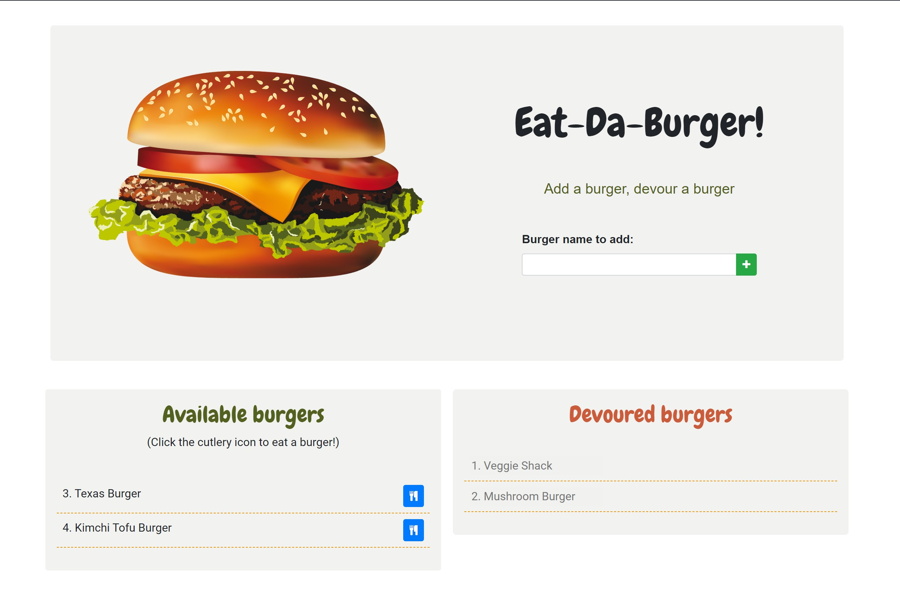

# Homework Assignment 13 - Burger Picker  

A burger logger app created using MySQL, Node, Express, Handlebars and a ORM. 

## Description

### Before You Begin

* Burger Logger is a restaurant app that lets users input the names of burgers they'd like to eat.

* Whenever a user submits a burger's name, the app will display the burger on the left side of the page -- Available burgers

* Each burger in the available area also has a cutlery button that allows the user to "devour" the burger. When the user clicks it, the burger will move to the right side of the page -- Devoured burgers.

* This app every burger in a database, whether devoured or not. 

## Application Links
[Heroku](https://shrouded-beyond-01705.herokuapp.com/)

[Portfolio Link](https://rad-a.github.io/08_portfolio/)

## Usage

To use this application, navigate to the [live link](https://shrouded-beyond-01705.herokuapp.com/). 
  1. ### Feel like eating a burger? 
      - Take a look at existing burgers in the "Available burgers" area and click the blue cutlery button next to the burger you want to devour. 
       - Watch the burger disappear (mover to  "Devoured burgers") before your eyes!
   2. ### Only want to add a burger for other users to devour? 
      -  Type the name of your burger in the "Burger name to add" input field at the top of the page.
      -  Click the green "+" button. 
      - Your burger is now added to the "Available burgers" area to be devoured. 
  3. ### To add and devour a burger, combine steps 1 and two above

## Contributions
To contribute to the project, please [contact me](https://rad-a.github.io/08_portfolio/) or fork this repository

## Application Image 

## Questions
For questions and suggestions, please [contact me](https://rad-a.github.io/08_portfolio/)

